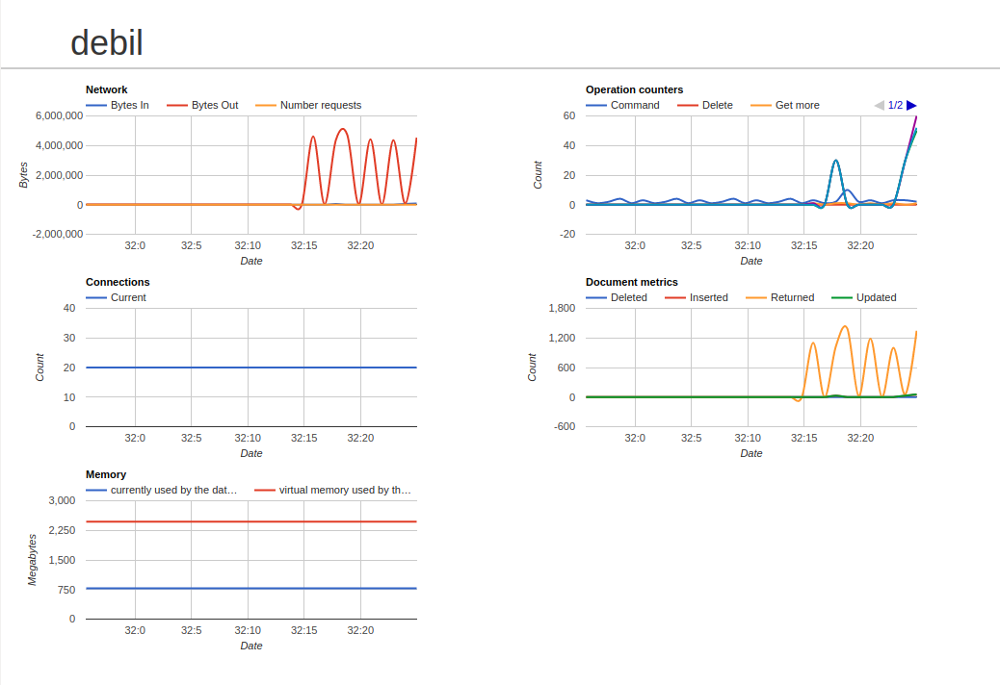

# debil

MongoDB monitoring service

## Usage

### Node.JS

    git clone https://github.com/gustavopaes/debil.git
    npm install
    MONGODB_URI=user:pass@mongodb.host:PORT node index.js

### Docker

    git clone https://github.com/gustavopaes/debil.git
    docker build -t debil .
    docker run -it --rm --name debil-run -p 8080:80 -e MONGODB_URI=user:pass@mongodb.host:PORT debil

## MongoDB Role

The `user` need to have `clusterMonitor` role:

    db.createUser(
      {
        user: "myStatsUser",
        pwd: "$trongp@assword",
        roles: [
          "clusterMonitor"
        ]
      }
    )
